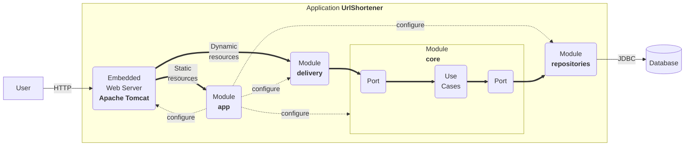

# Getting Started with the URL Shortener project

2024-08-31

## System requirements

This application leverages cutting-edge technologies to deliver a robust
and versatile user experience:

1.  **Programming Language**: The application is written in [Kotlin
    2.0.20](https://kotlinlang.org/), a versatile, open-source,
    statically-typed language. Kotlin is renowned for its adaptability
    and is commonly used for Android mobile app development. Beyond
    that, it finds application in server-side development, making it a
    versatile choice.

2.  **Build System**: The application utilizes [Gradle
    8.5](https://gradle.org/) as its build system. Gradle is renowned
    for its flexibility in automating the software building process.
    This build automation tool streamlines tasks such as compiling,
    linking, and packaging code, ensuring consistency and reliability
    throughout development.

3.  **Framework**: The application employs [Spring Boot
    3.3.3](https://docs.spring.io/spring-boot/) as a framework. This
    technology requires Java 17 and is fully compatible up to and
    including Java 21. Spring Boot simplifies the creation of
    production-grade [Spring-based applications](https://spring.io/). It
    adopts a highly opinionated approach to the Spring platform and
    third-party libraries, enabling developers to initiate projects with
    minimal hassle.

## Overall structure

The structure of this project is heavily influenced by [the clean
architecture](https://blog.cleancoder.com/uncle-bob/2012/08/13/the-clean-architecture.html):

- A `core` module where we define the domain entities and the
  functionalities (also known as use cases, business rules, etc.). They
  do not know that this application has a web interface or that data is
  stored in relational databases.
- A `repositories` module that knows how to store domain entities in a
  relational database.
- A `delivery` module that knows how to expose the functionalities on
  the web.
- An `app` module that contains the main application, the configuration
  (i.e., it links `core`, `delivery`, and `repositories`), and the
  static assets (i.e., HTML files, JavaScript files, etc.).



Usually, if you plan to add a new feature:

- You will add a new use case to the `core` module.
- If required, you will modify the persistence model in the
  `repositories` module.
- You will implement a web-oriented solution to expose it to clients in
  the `delivery` module.

Sometimes, your feature will not be as simple, and it may require:

- Connecting to a third party (e.g., an external server). In this case,
  you will add a new module named `gateway` responsible for such a task.
- An additional application. In this case, you can create a new
  application module (e.g., `app2`) with the appropriate configuration
  to run this second server.

Features that require connecting to a third party or having more than a
single app will be rewarded.

## Run

The application can be run as follows:

``` bash
./gradlew bootRun
```

Now you have a shortener service running at port 8080. You can test that
it works as follows:

``` bash
$ curl -v -d "url=http://www.unizar.es/" http://localhost:8080/api/link
*   Trying ::1:8080...
* Connected to localhost (::1) port 8080 (#0)
> POST /api/link HTTP/1.1
> Host: localhost:8080
> User-Agent: curl/7.71.1
> Accept: */*
> Content-Length: 25
> Content-Type: application/x-www-form-urlencoded
> 
* upload completely sent off: 25 out of 25 bytes
* Mark bundle as not supporting multiuse
< HTTP/1.1 201 
< Location: http://localhost:8080/tiny-6bb9db44
< Content-Type: application/json
< Transfer-Encoding: chunked
< Date: Tue, 28 Sep 2021 17:06:01 GMT
< 
* Connection #0 to host localhost left intact
{"url":"http://localhost:8080/tiny-6bb9db44","properties":{"safe":true}}%   
```

And now, we can navigate to the shortened URL.

``` bash
$ curl -v http://localhost:8080/6bb9db44
*   Trying ::1:8080...
* Connected to localhost (::1) port 8080 (#0)
> GET /tiny-6bb9db44 HTTP/1.1
> Host: localhost:8080
> User-Agent: curl/7.71.1
> Accept: */*
> 
* Mark bundle as not supporting multiuse
< HTTP/1.1 307 
< Location: http://www.unizar.es/
< Content-Length: 0
< Date: Tue, 28 Sep 2021 17:07:34 GMT
< 
* Connection #0 to host localhost left intact
```

## Build and Run

The uberjar can be built and then run with:

``` bash
./gradlew build
java -jar app/build/libs/app-0.2024.1-SNAPSHOT.jar
```

## Functionalities

The project offers a minimum set of functionalities:

- **Create a short URL**. See in `core` the use case
  `CreateShortUrlUseCase` and in `delivery` the REST controller
  `UrlShortenerController`.

- **Redirect to a URL**. See in `core` the use case `RedirectUseCase`
  and in `delivery` the REST controller `UrlShortenerController`.

- **Log redirects**. See in `core` the use case `LogClickUseCase` and in
  `delivery` the REST controller `UrlShortenerController`.

The objects in the domain are:

- `ShortUrl`: the minimum information about a short URL
- `Redirection`: the remote URI and the redirection mode
- `ShortUrlProperties`: a handy way to extend data about a short URL
- `Click`: the minimum data captured when a redirection is logged
- `ClickProperties`: a handy way to extend data about a click

## Delivery

The above functionality is available through a simple API:

- `POST /api/link` which creates a short URL from data send by a form.
- `GET /{id}` where `{id}` identifies the short URL, deals with
  redirects, and logs use (i.e. clicks).

In addition, `GET /` returns the landing page of the system.

## Repositories

All the data is stored in a relational database. There are only two
tables.

- **shorturl** that represents short URLs and encodes in each row
  `ShortUrl` related data,
- **click** that represents clicks and encodes in each row `Click`
  related data.

## Reference Documentation

For further reference, please consider the following sections:

- [Official Gradle documentation](https://docs.gradle.org)
- [Spring Boot Gradle Plugin Reference
  Guide](https://docs.spring.io/spring-boot/docs/current/gradle-plugin/reference/htmlsingle/)
- [Spring
  Web](https://docs.spring.io/spring-boot/reference/web/index.html)
- [Spring SQL
  Databases](https://docs.spring.io/spring-boot/reference/data/sql.html)

## Guides

The following guides illustrate how to use some features concretely:

- [Building a RESTful Web
  Service](https://spring.io/guides/gs/rest-service/)
- [Serving Web Content with Spring
  MVC](https://spring.io/guides/gs/serving-web-content/)
- [Building REST services with
  Spring](https://spring.io/guides/tutorials/rest/)
- [Accessing Data with
  JPA](https://spring.io/guides/gs/accessing-data-jpa/)

## Google Safe Browsing Integration 
### Description of the PoC
This feature is designed to ensure the safety of links shortened using the application. It checks each link against Google's Safe Browsing API to determine if it is safe. If a link is found to be unsafe, the feature provides detailed information to the user about the nature of the threat, such as phishing, malware, or other malicious activities. This helps users make informed decisions and avoid potentially harmful websites. 

In this Proof of Concept, we integrate with the Google Safe Browsing API to ensure the safety of URLs. It only verifies if the URL is safe or unsafe (boolean), but does not provide additional information about why is unsafe. This is done in `gateway/src/main/kotlin/es/unizar/urlshortener/gateway/GoogleSafeBrowsingClient.kt`. We define the use case for checking URLs against the API and create unit tests to validate the integration and functionality, with a good URL and a malicious one. This is done in `gateway/src/test/kotlin/es/unizar/urlshortener/gateway/GoogleSafeBrowsingClientTest.kt`. 

We have modified `core/src/main/kotlin/es/unizar/urlshortener/core/Ports.kt` to add the `SafetyService` port, added its implementation in `delivery/src/main/kotlin/es/unizar/urlshortener/infrastructure/delivery/PortsImpl.kt`, defined an `UnsafeUrlException` in `core/src/main/kotlin/es/unizar/urlshortener/core/Exceptions.kt`, and updated `core/src/main/kotlin/es/unizar/urlshortener/core/usecases/CreateShortUrlUseCase.kt` to verify if a URL is safe or not (using `SafetyService`). If it isn't, the exception is thrown and a warning is printed in the terminal, and then a handler returns `403 FORBIDDEN` HTTP code. 

In the future, it won't work like this: The use case will return `201` and then post a message to a broker, setting the `safe` URL property to `null`. The `SafetyService` will then read the message and verify if the URL is safe or not. If someone tries to access the URL during verification, the URL property will be `null` and a `400` error will be returned. When the service finishes its verification, it will update the URL property: if it is safe, it will set it to `true`; otherwise, it will set it to `false`. If it is not safe, an additional property `Information` will be populated with the reason why it is not safe. Whenever a user tries to access the URL, a `403 FORBIDDEN` error will be returned with the information about why it is not safe. This is not difficult to implement: instead of throwing the exception when creating the URL, we just create the URL, set `safe` to `null`, and put the message in the Kafka broker. We need two Kafka listeners: one waiting for incoming URL verifications to launch `SafetyService`, and another waiting for incoming safety updates which modify `url.properties.safe` and `url.properties.information`.

To integrate with Google Safe Browsing API, we have followed this guide: https://developers.google.com/safe-browsing/v4/get-started?hl=es-419 

### Justification for the choice of any additional libraries or frameworks
This feature has been implemented without the use of any additional libraries or frameworks. It operates on a simple request/response model with Google's API. Since it integrates with other services, the integration class has been placed in the "gateway" module.

Our API key has been added directly in the code, which is not a recommended practice as it can be stolen. To ensure its security, in a real scenario, it should be added as an environment variable on the hosts used to implement, test and deploy this functionality. For CI tests to pass, it should also be added to GitHub Secrets. However, to make it easier for the instructor to review our project, we have not done this.

### Challenged encountered and how they were addressed 
The first challenge we faced was adding the new module 'gateway' to the modules that use it. It was very easy: we just needed to import it in the module's `settings.gradle.kts` file by adding the following line: `implementation(project(":gateway"))`. We addressed it by looking at other `settings.gradle.kts` files.

Another challenge we faced was injecting `restTemplate` into `GoogleSafeBrowsingAPIClient` without violating Clean Architecture principles. Since this is just a PoC, we decided to build it inside the class if it is not provided. We are studying how to inject it in a better way.

### Instructions to run the PoC
To run this PoC, project should be built and passing the tests, essencialy `gateway/src/test/kotlin/es/unizar/urlshortener/gateway/GoogleSafeBrowsingClientTest.kt`, `creates returns unsafe URL exception if the URL is not safe` on `core/src/test/kotlin/es/unizar/urlshortener/core/CreateShortUrlUseCaseTest.kt` and `creates returns forbidden if the URL is not safe` on `app/src/test/kotlin/es/unizar/urlshortener/app/IntegrationTests.kt`. This can be achieved running `./gradlew build` (or `gradlew.bat build` on Windows) command. 

To manually check this PoC's effectiveness, go to `http://localhost:8080` and try to shorten a safe URL (e.g., `http://www.unizar.es`). Everything will work as expected: the URL will be shortened. Then, try to shorten an unsafe one (you can find many at `http://testsafebrowsing.appspot.com/`). An ERROR will be returned, and if you check the server response, you'll see a 403 FORBIDDEN. In the terminal, "URL is not safe" will be printed.

### Implemented Tests

The tests validate the functionality by invoking the `isSafe()` function of the `GoogleSafeBrowsingClient`, which connects to the Google Safe Browsing API. The results are then compared with the expected outcomes. We use two test cases: a non-malicious website (www.unizar.es) and a malicious website (taken from an online database of malicious websites, https://testsafebrowsing.appspot.com/). This ensures that our implementation correctly identifies safe and unsafe URLs. This test is in  `gateway/src/test/kotlin/es/unizar/urlshortener/gateway/GoogleSafeBrowsingClientTest.kt` 

We have also updated `core/src/test/kotlin/es/unizar/urlshortener/core/CreateShortUrlUseCaseTest.kt` with a new test `creates returns unsafe URL exception if the URL is not safe`, which verifies that `UnsafeUrlException` is thrown if the URL is not safe. Additionally, we updated `app/src/test/kotlin/es/unizar/urlshortener/app/IntegrationTests.kt` with a test `creates returns forbidden if the URL is not safe`, which checks that a 403 status code is returned if the URL is not safe.

## Enable users to save their links
### Description of the PoC
This feature enables user authentication and personalized link management within the application. Through Google OAuth integration, users can log in, create accounts, and manage their unique collections of links. The application maintains link-specific data, including click counts, target URLs, and optional QR code generation. Each user can create, view, and delete links, with their link data stored securely in the database under a unique user identifier (sub), providing a straightforward way to track ownership and link-specific metrics.

This Proof of Concept (PoC) introduces a local database system that enables structured data storage for user accounts and link management. Key components include the creation of database tables, data classes for structured data representation, and a basic use case for inserting new users and links. The system is designed to simplify future expansion, making it straightforward to add functionalities for more complex user and link operations.

We modified the file to add the new data classes User and Link, which are essential for managing user information and their links, this is done in `/core/src/main/kotlin/es/unizar/urlshortener/core/Domain.kt`. Afterward, we updated the entity file to enable the storage of a User entity and a Link entity in the database. A Link contains the Click, the ShortUrl, and the user it belongs to. I also modified the converters for transforming between domain objects and entities, both ways. You can find the updates in the following path: `/repositories/src/main/kotlin/es/unizar/urlshortener/infrastructure/repositories/Entities.kt`.

We created the repositories in `/repositories/src/main/kotlin/es/unizar/urlshortener/infrastructure/repositories`
Repositories.kt to manage the persistence of User and Link entities in the database. These repositories facilitate essential operations, including saving new entries, inserting data, and retrieving records by their IDs, ensuring efficient interaction with the underlying database.

Additionally, we implemented the GetUserInformationUseCase in `core/src/main/kotlin/es/unizar/urlshortener/core/usecases/CreateShortUrlUseCase.kt`, which centralizes user-related functionalities. This use case first checks if a user already exists in the database; if not, it inserts a new user entry, ensuring proper registration before users can create links. It also allows users to insert a sample link, providing them with a quick way to test or demonstrate functionality within their accounts. Furthermore, the use case includes a method to retrieve all links associated with a specific user.

Finally we implemented a security configuration bean that manages access controls for Google OAuth authentication. This bean, done in `/app/src/main/kotlin/es/unizar/urlshortener/ApplicationConfiguration.kt`,is responsible for configuring the security filter chain to specify how authentication and authorization should be handled within the application.

### Justification for the choice of any additional libraries or frameworks
We chose spring-boot-starter-security for its comprehensive security features that simplify the process of securing our APIs and managing authentication and authorization. This library integrates seamlessly with the Spring ecosystem, allowing for quick setup of security measures and enabling best practices out of the box.

Additionally, the spring-security-config library is essential for customizing security settings, as it allows us to configure security filters, specify authentication rules, and define user roles and permissions. This flexibility is crucial for implementing fine-grained access control especially as our application grows and requires more complex security configurations. Furthermore, we opted for spring-boot-starter-oauth2-client to facilitate authentication using OAuth2 and OpenID Connect protocols. 


